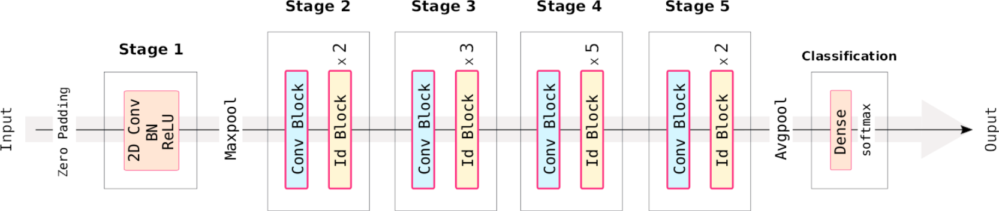

# Summary

Deep residual network (ResNet50) to classify RGB images of time-frequency (TF) Morlet wavelet scalograms of gravitational waves from core-collapse supernovae (CCSNe). We performed a three-class classification, in which the target label is assigned if the slope of the High Frequency Feature (HFF), present in the scalograms, belongs to one of three mutually exclusive slope ranges.

This multi-class classification allows us to study the detectability of the HFF because, depending on the CCSN model and the noise realization, the visibility of the HFF can vary. Moreover, as proof of principle, it allows us to evaluate our ability to discriminate between CCSN parameter configurations (expressed in HFF slope ranges) that are potentially discoverable through future LIGO and Virgo observations.

This project draws on datasets generated in projects [datagen-sngw-phen](https://github.com/ManuelDMorales/datagen-sngw-phen) and [datagen-sngw-genrel](https://github.com/ManuelDMorales/datagen-sngw-genrel), which consist of window strain time series containing interferometric noise plus gravitational waves from CCSNe. Jupyter notebooks developed in Python by Manuel D. Morales (e-mail: <manueld.morales@academicos.udg.mx>).

# Science background

The samples used in this project consist of time series of real noise from LIGO (L1, H1) and (V1) interferometric detectors from the O3b run plus gravitational wave signals from CCSN, bot phenomenological waveforms, and general relativistic waveforms. In all cases, these waveforms contain the HFF which, depending on the model and the noise, is more or less visible.

Phenomenological waveforms come from a stochastic non-physical model that mimics the HFF, see [Astone et al Phys. Rev. D 98, 122002 (2018)](https://doi.org/10.1103/PhysRevD.98.122002). On the other hand, general relativistic waveforms are a modified version of those obtained from three multidimensional CCSN simulations: [Andresen 2019 m15nr h+](https://doi.org/10.1093/mnras/stz990), [Morozova 2018 M13_SFHo h+](https://doi.org/10.3847/1538-4357/aac5f1), and [Cerda-Duran 2013 fiducial h+](https://iopscience.iop.org/article/10.1088/2041-8205/779/2/L18). The modification of the general relativistic waveforms has to do with the fact that all features other than the HFF were removed or filtered.

The three target labels for the classification are defined as follows:

- Class 1:  1,620 =< HFF slope =< 4,990
- Class 2: 1,450 =< HFF slope < 1,620
- Class 3: 950 =< HFF slope < 1,450

Fig. 1 Shows the ResNet50 architecture used in this project. This is formed by five stages in which identity blocks and/or convolutional blocks are applied, plus a classification stage with a dense (fully connected) layer with a softmax activation giving three probabilistic scores per class. Besides, after stages 1 and 5, a max pooling and an average pooling, respectively, are applied to reduce the system resources. Also notice that at the beginning, a zero padding is applied to the input data. If you are not familiar with deep residual learning, we recommend to explore the seminal paper [He et al CVPR, 770-778 (2016)](https://doi.org/10.1109/CVPR.2016.90).

<br/>


<b>Figure 1</b>. Residual deep learning architecture used in this project: ResNet50. It consists of 50 layers in the main path, and 23,593,859 model parameters occupying 90MB in memory.

# Implementation structure

```
resnet50-sngw-hff
|___ Codes
     |___ Apply_ResNet50.ipynb
     |___ Convert_StrainImage.ipynb
|___ Datasets
     |___ GenRelWf
          |___ Distance_1Kpc
          |___ Distance_5Kpc
          |___ Distance_10Kpc
     |___ PhenWf
|___ Metrics
     |___ kfold_CV
|___ Models
     |___ Best_training
     |___ GridSearchCV
     |___ Single_learning
|___ LICENCE
|___ README.md
```

The codes were run in Google Colaboratory, in the following order:

`Convert_StrainImage.ipynb` for reading window strain datasets and converting them into RGB images of TF Morlet wavelet pixelized scalograms. Data can be loaded from two exclusive folders: PhenWf and GenRelWf for phenomenological and general relativistic waveforms, respectively. RGB images are generated by copying each pixel of the grayscale TF image into their pixels in red, green (G), and blue (B) channels.

`Apply_ResNet50.ipynb` for apply the ResNet50 model. This script has a high-level structure consisting of two big sections: the first is for training and testing with phenomenological waveforms, and the second is for testing with general relativistic waveforms.

# Important instructions

1. All scripts were run in a specific Google Drive location, then you will need to edit the high-level path location in which the project (resnet50-sngw-hff) is located.
   
2. Notice that the Datasets folder, as shown in the project's tree, has a specific hierarchical structure. For the first run, it is highly recommended to maintain this structure. If you run [datagen-sngw-phen](https://github.com/ManuelDMorales/datagen-sngw-phen) and/or [datagen-sngw-genrel](https://github.com/ManuelDMorales/datagen-sngw-genrel) to generate datasets, you will need to locate the highest output folders inside the PhenWf folder and/or the GenRelWf/Distance_dKpc (with "d" the distance from the CCSN), respectively.

3. The first section of `Apply_ResNet50.ipynb` script is more computationally intensive to run than its second section. Then, after running GridSearch CV and finding the best hyperparameter combination (section 7.2), the ResNet50 is trained with these hyperparameters, and the final model is saved in the Models/Best_training folder. If you run in this form, always save the best model to make it easily available for testing with phenomenological and general relativistic waveforms.

5. `Apply_ResNet50.ipynb` script has two input parameter fields: subsection I.1. for phenomenological waveforms, and subsection II.2. for general relativistic waveforms. Both sections input the choice of interferometers' data, but only the second the distance from the CCSN.

6. For testing purposes, subsection II.5 of `Apply_ResNet50.ipynb` script can be omitted. This was implemented for exploratory data analysis with general relativistic waveforms, considering the whole dataset, namely the TF Morlet wavelet image samples at the three default distances (1, 5, and 10 Kpc) with the three CCSN models. If you run this subsection with less data, it will surely give you errors.
   
7. Saving plots as images is not mandatory in the codes. However, if you want it, you will need to create a folder "Figures" at the highest folder hierarchy of the project, and to uncomment line(s) with the plt.savefig statements in the scripts, for the desired plot(s).

# Cite this work

If you use this software in your work, please cite it using the following metadata:

```
@software{Morales_resnet50-sngw-hff_2024,
author = {Morales, Manuel David},
title = {{resnet50-sngw-hff}},
url = {https://github.com/ManuelDMorales/resnet50-sngw-hff},
version = {1.0.0},
year = {2024}
}
```
# About GPL-3.0 licence

Notice this code is shared under a GNU General Public Licence 3.0, which is a strong copyleft license. It means that any copy or modification of the original software must also be released under the GPL-3.0. The choice of this licence is aligned to Open Science practices. More details about GPL-3.0 in the file [README.md](https://github.com/ManuelDMorales/resnet50-sngw-hff/blob/main/LICENSE). We also suggest to see the [UNESCO Recomendation on Open Science](https://www.unesco.org/en/open-science/about?hub=686).
